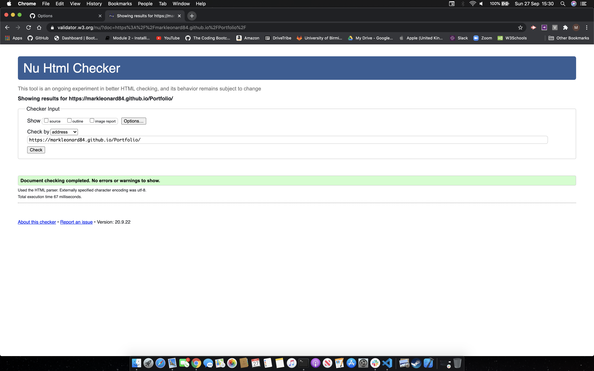

# **Responsive Portfolio**

## Outline.
---
* To create a personalised, mobile responsive portfolio utilizing Boostrap CSS Framework. 
* In addition, the site must contain

* A Navbar 
* Responsive layout
* Responsive images.

My Portfolio can be accessed at 
https://markleonard84.github.io/Portfolio/

---
## Validation.

I used W3C Validation Service - https://validator.w3.org/ to ensure valid and correct HTML.

